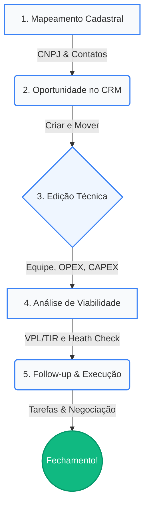
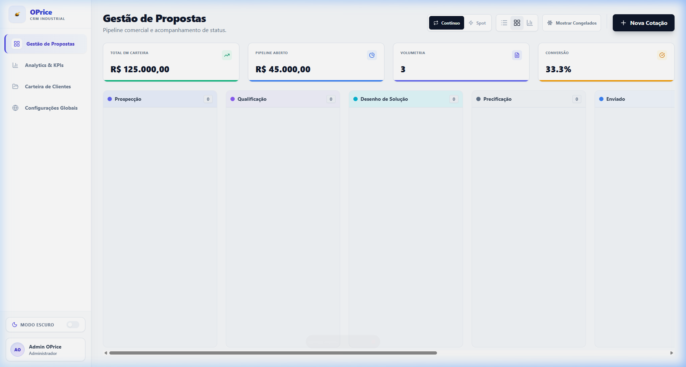
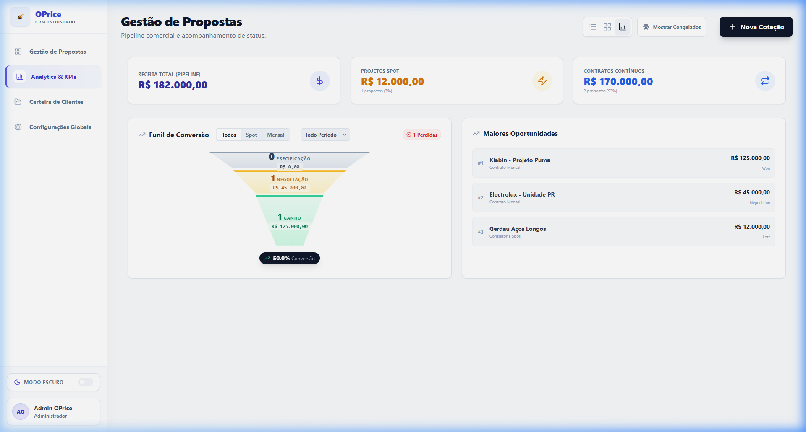
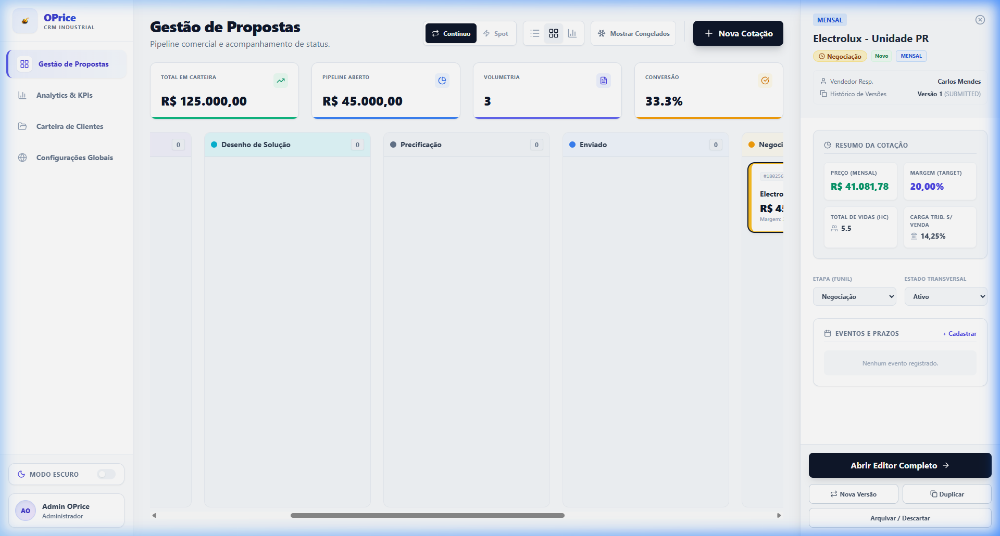
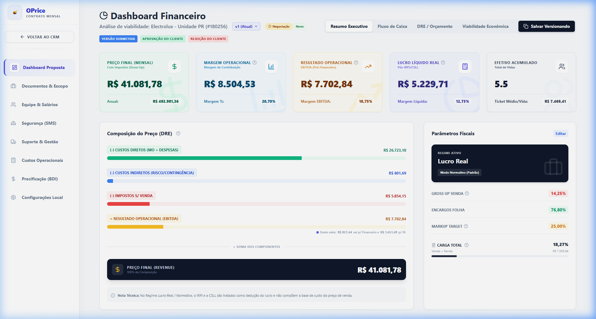
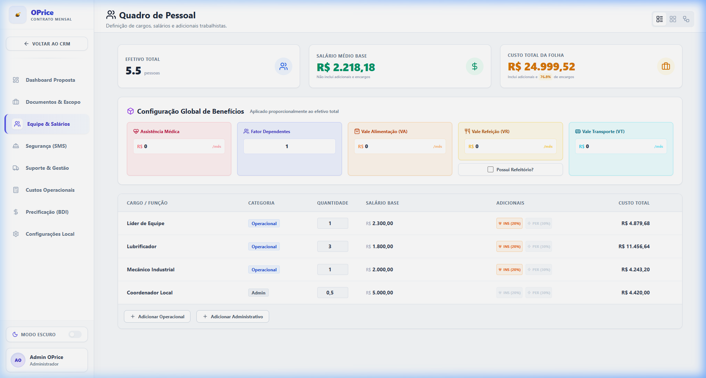
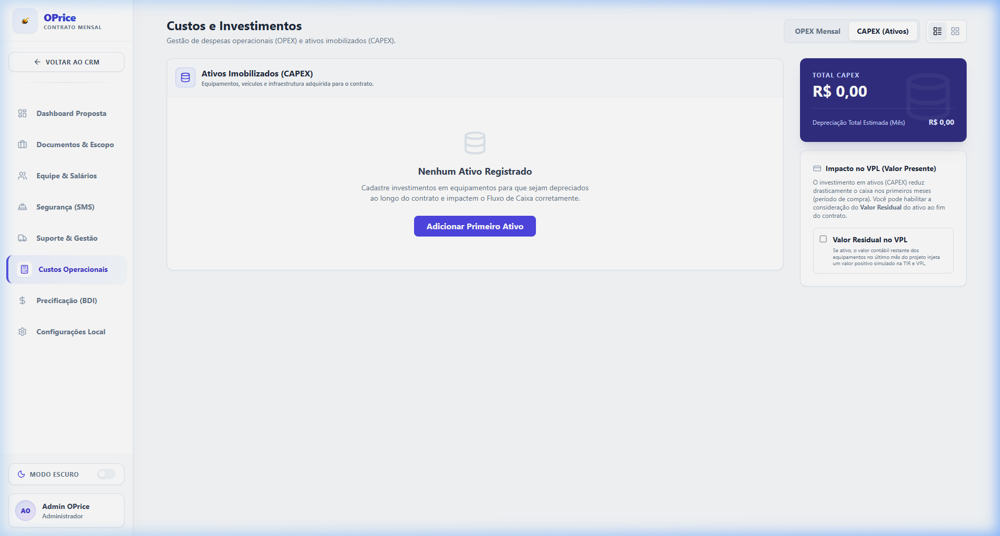
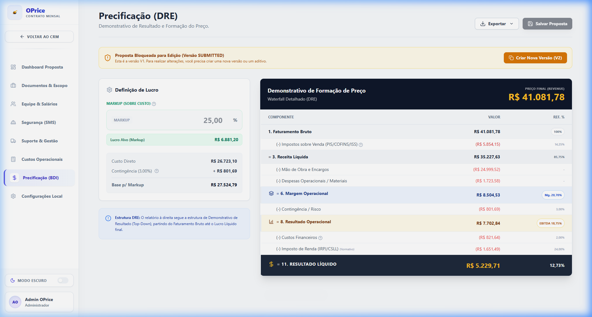

# 📘 OpCapex — Manual do Usuário

**Versão:** 1.0  
**Última atualização:** Março 2026  
**Subtítulo:** Industrial Viability Engine

---

## Sumário

1. [Visão Geral do Sistema](#1-visão-geral-do-sistema)
2. [Ciclo de Trabalho (Fluxo Industrial)](#2-ciclo-de-trabalho-fluxo-industrial)
3. [Módulo CRM — Gestão de Oportunidades](#3-módulo-crm--gestão-de-oportunidades)
   - 3.1 [Visão Kanban](#31-visão-kanban)
   - 3.2 [Visão Lista](#32-visão-lista)
   - 3.3 [Visão Analytics](#33-visão-analytics)
   - 3.4 [Contas e Carteira de Clientes](#34-contas-e-carteira-de-clientes)
   - 3.5 [Gestão de Contatos](#35-gestão-de-contatos)
   - 3.6 [Tarefas e Múltiplas Visões](#36-tarefas-e-múltiplas-visões)
   - 3.7 [Criando uma Nova Oportunidade](#37-criando-uma-nova-oportunidade)
   - 3.8 [Sidebar — Resumo da Cotação](#38-sidebar--resumo-da-cotação)
4. [Editor de Proposta — Precificação](#4-editor-de-proposta--precificação)
   - 4.1 [Dashboard (Resumo Executivo)](#41-dashboard-resumo-executivo)
   - 4.2 [Equipe (Quadro de Pessoal)](#42-equipe-quadro-de-pessoal)
   - 4.3 [Custos e Investimentos (OPEX / CAPEX)](#43-custos-e-investimentos-opex--capex)
5. [Versionamento de Propostas](#5-versionamento-de-propostas)
6. [Workflow de Aprovação](#6-workflow-de-aprovação)
7. [Configurações Globais](#7-configurações-globais)
8. [Glossário de Termos](#8-glossário-de-termos)

---

## 1. Visão Geral do Sistema

O **OpCapex** é uma plataforma de precificação e viabilidade financeira para **contratos de serviços industriais**. Ele combina um CRM visual (estilo Kanban) com um motor de cálculos financeiros que gera automaticamente:

- **Preço de Venda (Faturamento Bruto)** com base nos custos + markup/margem.
- **DRE Mensal** (Demonstração do Resultado do Exercício).
- **Fluxo de Caixa Projetado** com VPL, TIR e Payback.
- **Análise de Viabilidade** com Health Check e métricas de risco.

O sistema suporta dois tipos de proposta:
| Tipo | Descrição |
|---|---|
| **Continuado (Mensal)** | Contratos recorrentes com faturamento mensal. Pipeline: Prospecção → Qualificação → Proposta → Negociação → Fechamento |
| **Spot (Pontual)** | Projetos únicos com escopo fechado. Pipeline: Briefing → Escopo → Orçamento → Entrega |

---

## 2. Ciclo de Trabalho (Fluxo Industrial)

Para obter o máximo de precisão na precificação, siga este fluxo padrão:



1.  **Mapeamento Cadastral**: Cadastre a Conta via CNPJ com automação e identifique os Contatos-chave (decisores e viabilizadores).
2.  **Oportunidade (CRM)**: Crie a proposta no funil correto (Continuado ou Spot), defina as premissas iniciais e avance o card de prospecção.
3.  **Edição Técnica**: Monte o modelo de negócio configurando a Equipe (Salários), Consumíveis (OPEX) e Equipamentos (CAPEX) para formar o preço final e a margem bruta no DRE.
4.  **Aprovação & Versionamento**: Avalie os indicadores financeiros (VPL e Heath Check). Congele versões comerciais do histórico e submeta cenários de rentabilidade sensível ao Gestor.
5.  **Follow-up (Tarefas)**: Após gerar e extrair o **PDF Oficial** da sua Proposta, governe suas interações futuras ativamente usando a aba Tarefas do CRM até atingir o aceite.

---

## 3. Módulo CRM — Gestão de Oportunidades

O CRM é a tela principal do sistema. Nele você visualiza **todas as oportunidades** em andamento, filtra por pipeline, pesquisa por cliente ou responsável, e gerencia o ciclo de vida das cotações.

### 3.1 Visão Kanban

A visão padrão. Cada coluna representa um **estágio do pipeline**:



**Pipeline Continuado:**
| Estágio | Significado |
|---|---|
| 🔵 Prospecção | Lead identificado, ainda não qualificado |
| 🟡 Qualificação | Necessidades do cliente sendo mapeadas |
| 🟠 Proposta | Cotação enviada ao cliente |
| 🔴 Negociação | Em fase de ajustes finais de preço/escopo |
| 🟢 Fechamento | Contrato sendo formalizado |
| ✅ Won | Negócio fechado com sucesso |
| ❌ Lost | Negócio perdido |

**Como mover um card:**
- **Arrastar e soltar** (Drag & Drop) o card de uma coluna para outra.
- Isso atualiza automaticamente o estágio da oportunidade.

### 3.2 Visão Lista

Exibe todas as oportunidades em formato de tabela. Ideal para:
- Buscar rapidamente por **nome do cliente** ou **ID da proposta**.
- Ordenar por valor, data de criação ou responsável.
- Clicar em uma linha para abrir a **sidebar de preview**.

### 3.3 Visão Analytics

Painel analítico com KPIs consolidados do pipeline:

- **Funil de Conversão**: Mostra o volume financeiro em cada estágio.
- **Win Rate**: Percentual de oportunidades convertidas (Won) vs total.
- **Valor Total do Pipeline**: Soma estimada de todas as oportunidades ativas.
- **Ticket Médio**: Valor médio por oportunidade.

### 3.4 Contas e Carteira de Clientes

O submódulo de Contas permite gerenciar de forma inteligente as empresas com as quais você se relaciona, criando uma base unificada para as análises financeiras.

- **Classificação Transparente**: As contas são visualizadas e filtradas em três tipos estratégicos:
  - **Lead**: Prospecção inicial, cliente mapeado mas sem contato formal ou proposta.
  - **Prospect**: Conta ativa em fase de atendimento, desenvolvimento ou com propostas na mesa.
  - **Client**: Conta já conquistada com pelo menos um contrato ganho (ativo na carteira).
- **Inteligência Cadastral e Automação**: Ao cadastrar ou editar um cliente, o sistema oferece ferramentas de produtividade robustas:
  - **Busca via CNPJ (BrasilAPI & CNPJ.ws)**: Insira o CNPJ e clique em **"Buscar"**. O sistema preenche automaticamente um dossiê completo:
    - **Razão Social, Nome Fantasia e Situação Cadastral**.
    - **Inscrição Estadual (SEFAZ)**: Consulta automática da IE ativa.
    - **Endereço Detalhado**: Preenchimento granular de CEP, Logradouro, Número, Bairro, Cidade e Estado (UF).
    - **Segmentação Estratégica**: Além do Segmento principal, o sistema traz o **Sub-segmento** (CNAE secundário) para melhor categorização da conta.
  - **Máscaras de Entrada**: Campos de CNPJ e Inscrição Estadual possuem formatação automática durante a digitação para evitar erros.
  - **Mapeamento de Grupos**: Identifique se a unidade pertence a um **Grupo Econômico** maior para visões consolidadas.
- **Visibilidade Flexível**: Alterne rapidamente entre a **Visão Lista** (tabela) e a **Visão Grade** (cards visuais com badges de status e segmento).
- **Barra de Inteligência Financeira (Sidebar)**: Ao selecionar uma conta, a barra lateral exibe KPIs como LTV (Lifetime Value), Pipeline Aberto e histórico de propostas.

### 3.5 Gestão de Contatos

Stakeholders mudam de empresa e posição. A aba de Contatos é onde você organiza essa rede de pessoas, vinculando-as de fato às Contas criadas.

- **Filtros e Busca Integrados**: Encontre qualquer stakeholder pesquisando por e-mail, nome ou cargo.
- **Nível de Influência (Papel de Compra)**: Classifique os contatos com badges visuais:
  - **Decisor Principal**: Quem assina o contrato e avalizará o ROI.
  - **Influenciador**: Agente interno focado em resolver dores operacionais.
  - **Avaliador**: Perfil técnico de compliance ou suprimentos.
  - **Usuário Final**: Quem lidará com a entrega diariamente.
- **Perfil Profissional (LinkedIn)**: Adicione URLs de LinkedIn para acesso rápido ao perfil do contato diretamente pelo card.
- **Ações Rápidas (Deep Links)**: Atalhos diretos para disparar e-mails ou chamadas telefônicas via aplicativos padrão do seu computador.

### 3.6 Tarefas e Atividades (Multi-View)

O módulo de Tarefas foi reformulado para ser o centro de controle produtivo da sua rotina comercial.

- **Indicadores de Performance (KPIs)**: No topo da página, acompanhe o volume de tarefas **Totais**, **Atrasadas**, **Em Dia** e **Concluídas** para o filtro selecionado.
- **Múltiplos Modos de Visualização**:
  - **Lista (Default)**: Visão tabular otimizada para triagem rápida, com ícones coloridos por tipo de ação.
  - **Kanban**: Organize suas tarefas em colunas de progresso (*A Fazer*, *Em Andamento*, *Concluído*).
  - **Calendário**: Visão de agenda para visualizar a carga de trabalho futura e não sobrepor compromissos.
- **Responsabilidade e Filtros**:
  - **Atribuição**: Defina um **Responsável** para cada tarefa (Assignee).
  - **Filtros Inteligentes**: Filtre instantaneamente por *Tipo de Ação* (Reunião, Call, Email, Follow-up) ou por *Responsável* (ex: visualizar apenas as "Minhas" tarefas).
- **Vínculos e Contexto**: Anexe tarefas graficamente a um Contato, Conta (Empresa) ou a uma Proposta específica na precificação.
- **Status Inteligentes**:
  - **Atrasada**: Identificação imediata via badge vermelho se a data limite for menor que hoje.
  - **Concluída**: Marque o checkbox para finalizar a ação (fundo esmeralda e texto riscado).

### 3.7 Criando uma Nova Oportunidade

1. Clique no botão **"+ Nova Oportunidade"** no canto superior direito do CRM.
2. No modal que aparece, preencha:
   - **Tipo de Serviço**: Continuado (Mensal) ou Spot (Pontual).
   - **Cliente**: Selecione um cliente existente na lista.
   - **Motion (Tipo de Negócio)**:
     | Motion | Quando usar |
     |---|---|
     | New Business | Cliente novo ou primeiro contrato |
     | Renewal | Renovação de contrato existente |
     | Expansion | Expansão de escopo, volume ou site |
3. Clique em **"Criar"**. A nova oportunidade aparecerá no primeiro estágio do pipeline selecionado.

### 3.8 Sidebar — Resumo da Cotação

Ao clicar em um card no Kanban (ou em uma linha na Lista), a **sidebar direita** abre com o resumo:



- **Informações do Cliente**: Nome, CNPJ, contato.
- **Dados Financeiros**: Valor mensal, headcount total, margem operacional.
- **Versão**: Número da versão atual e total de versões criadas.
- **Responsável**: Quem está conduzindo a negociação.
- **Milestones**: Marcos importantes com datas.

**Botões de ação na sidebar:**
| Botão | Ação |
|---|---|
| 📝 Editar | Abre o editor completo da proposta (Precificação) |
| 📋 Duplicar | Cria uma cópia da proposta |
| 🗑️ Excluir | Remove a proposta permanentemente |
| 🔁 Nova Versão | Cria uma versão incrementada (v1 → v2) |

### 3.9 Pipeline Continuado vs Spot

No topo do CRM existe um **seletor de pipeline**. Ao alternar entre "Continuado" e "Spot":
- Os estágios do Kanban mudam automaticamente.
- Os KPIs e filtros se adaptam ao tipo de projeto selecionado.
- Ao criar uma nova oportunidade, o pipeline do tipo selecionado é utilizado.

### 3.10 Status Transversais (Ativo, Congelado, Arquivado)

Além do estágio no pipeline, cada oportunidade possui um **status transversal**:

| Status | Comportamento |
|---|---|
| **Ativo** | Oportunidade em progresso normal. Visível nos KPIs. |
| **Congelado** | Negociação pausada temporariamente. Excluída dos KPIs do funil. Pode ser reativada. |
| **Arquivado** | Removida da visualização padrão. Não contabiliza em nenhum indicador. |

- Para **Congelar**: Clique direito no card → "Congelar". Defina uma data de retorno.
- Para **Arquivar**: Clique direito → "Arquivar".
- Oportunidades em estágio **Won** ou **Lost** têm o editor bloqueado (somente leitura).

### 2.11 Milestones

Milestones são marcos importantes do ciclo de vida de uma oportunidade. Exemplos:
- "Visita Técnica agendada — 15/03"
- "Proposta final enviada — 20/03"

**Como criar:**
1. Na sidebar, role até a seção **Milestones**.
2. Clique em **"+ Adicionar"**.
3. Preencha o título e a data.
4. O milestone aparece como uma linha do tempo na sidebar.

### 2.12 Ações Rápidas (Clique Direito)

No Kanban, clique com o **botão direito** sobre qualquer card para acessar:
- **Editar Proposta** → Abre o editor completo.
- **Duplicar** → Copia a proposta.
- **Nova Versão** → Cria v2, v3, etc.
- **Congelar / Descongelar** → Pausa temporária.
- **Arquivar** → Remove da vista ativa.
- **Excluir** → Remoção permanente.

---

## 3. Editor de Proposta — Precificação

Ao clicar em **"Editar"** em qualquer oportunidade, o sistema abre o **Editor de Proposta** com diversas abas na barra lateral esquerda. Cada aba cuida de um componente do preço.

### 3.1 Dashboard (Resumo Executivo)

A primeira tela que você vê ao abrir uma proposta. Ela reúne todos os indicadores calculados automaticamente:



**KPIs Principais:**
| Indicador | O que é |
|---|---|
| Faturamento Bruto | Valor mensal da nota fiscal |
| Receita Líquida | Faturamento menos impostos sobre venda |
| Custo Direto Total | Mão de obra + materiais + segurança + suporte |
| Margem de Contribuição | Receita Líquida menos Custos Diretos |
| Resultado Operacional | Margem menos riscos e contingências |
| Resultado Líquido | Lucro final após impostos sobre renda |

**Seções do Dashboard:**
- **Health Check**: Semáforo visual (🟢🟡🔴) que indica se a margem está saudável.
- **Viabilidade Financeira**: VPL (Valor Presente Líquido), TIR, Payback e WACC.
- **Fluxo de Caixa**: Gráfico com projeção mês a mês de entradas e saídas.
- **DRE Projetado**: Tabela mensal completa mostrando receitas, custos e lucro.

**Aprovação e Versionamento:**
- No topo do Dashboard, é possível:
  - **Salvar como Nova Versão** (botão "Nova Versão").
  - **Submeter para Aprovação** (se a margem estiver abaixo do mínimo permitido).

### 3.2 Equipe (Quadro de Pessoal)

Define a **composição da equipe** que será alocada no contrato.

**Três modos de visualização:**



| Modo | Uso |
|---|---|
| 📋 Lista | Tabela com todos os cargos, salários e quantidades. Mais produtivo para entrada de dados. |
| 📦 Grid | Cards visuais com cada cargo. Bom para apresentações. |
| 🔗 Organograma | Canvas interativo estilo Miro para montar a estrutura hierárquica. |

**Campos por cargo:**
- **Título**: Ex: "Técnico Mecânico", "Supervisor de Turno".
- **Categoria**: Operacional ou Administrativo.
- **Salário Base**: Valor mensal do salário.
- **Quantidade**: Número de profissionais naquele cargo.
- **Adicionais**: Insalubridade (+20%) e/ou Periculosidade (+30%).

**Benefícios (configuração centralizada):**
- Plano de Saúde (com fator de dependentes).
- Vale Alimentação / Refeição.
- Vale Transporte.
- A configuração de benefícios é compartilhada por todos os cargos e exibida acima da lista.

**Canvas (Organograma):**
- Arraste os cards para posicionar.
- Conecte cargos clicando nos **pontos de conexão** (bolinhas) que aparecem ao redor do card.
- Clique direito para: Duplicar, Mudar cor, Desconectar ou Excluir.
- Use a **barra flutuante** na parte inferior para adicionar áreas, cargos e ícones decorativos (Fábrica, Risco Químico, etc).

### 3.3 Custos e Investimentos (OPEX / CAPEX)

Esta aba possui **duas sub-abas**:

#### OPEX Mensal
Custos recorrentes de materiais e insumos, divididos em 4 categorias:

| Categoria | Exemplos |
|---|---|
| 🛡️ EPIs & Uniformes | Capacetes, óculos, botinas, uniformes |
| 🔧 Ferramental | Chaves, martelos, trena laser |
| 🚛 Veículos & Logística | Aluguel de veículo, combustível |
| 💻 TI & Consumíveis | Notebooks, celulares, impressão |

**Campos por item:**
- **Nome**: Descrição do material.
- **Valor Unitário**: Preço de compra.
- **Vida Útil**: Em meses (o sistema rateia o valor automaticamente).
- **Alocação**: `Fixo` (1 unidade) ou `x HC` (multiplicado pelo headcount operacional).

**Provisão Mensal** = (Valor Unitário / Vida Útil) × Quantidade

> **Kit Padrão**: Clique em "Importar Kit Padrão" para carregar um pacote pré-configurado de EPIs, Ferramentas ou Veículos.

#### CAPEX (Ativos Imobilizados)
Investimentos em bens de capital que são **comprados** (não alugados):



**Campos por ativo:**
- **Nome**: Ex: "Retroescavadeira CAT 416F".
- **Valor de Aquisição**: Preço total do bem.
- **Vida Útil**: Período de depreciação contábil (em meses).
- **Mês da Compra**: Quando o ativo é adquirido (Mês 0 = início do contrato).
- **Pagamento**: À Vista ou Parcelado (com número de parcelas).

**Impacto financeiro:**
- **No DRE**: O valor do ativo é **depreciado linearmente** todo mês (Valor ÷ Vida Útil).
- **No Fluxo de Caixa**: A saída de caixa ocorre no mês da compra (à vista) ou distribuída nas parcelas.
- **No Preço**: A depreciação é incluída na base de custo para markup, garantindo recuperação do investimento.

**Valor Residual no VPL:**
Na sidebar direita da aba CAPEX, existe um checkbox: `"Valor Residual no VPL"`. Se ativado, o valor contábil do ativo ainda não consumido pela depreciação (ao final do contrato) é injetado como uma entrada positiva no último mês do Fluxo de Caixa, melhorando a TIR e o VPL simulados.

### 3.4 Segurança (SST)

Custos de Saúde e Segurança do Trabalho:
- **Exames Admissionais / Periódicos**: Custo por pessoa × frequência.
- **Treinamentos Obrigatórios**: NR-10, NR-35, NR-33, etc.
- **PCMSO / PPRA**: Programas de saúde ocupacional.

Cada item pode ser ativado/desativado e possui:
- Custo por cabeça.
- Frequência (em meses).

O sistema calcula automaticamente o **rateio mensal** e soma ao Custo Direto.

### 3.5 Suporte Técnico

Custos de gestão e supervisão remota/presencial:
- **Descrição**: Ex: "Visita Gestor Operacional".
- **Frequência**: Semanal, quinzenal, mensal.
- **Custo por Visita**: Valor unitário.
- **Quantidade**: Número de visitas por ciclo.

### 3.6 Impostos

Configuração fiscal da proposta:

**Impostos sobre Faturamento (Venda):**
| Imposto | Alíquota Padrão |
|---|---|
| PIS | 1,65% |
| COFINS | 7,60% |
| ISS | 5,00% |

**Impostos sobre Renda:**
| Imposto | Alíquota Padrão |
|---|---|
| IRPJ | 15,00% |
| CSLL | 9,00% |

**Modo de Cálculo:**
- **Normativo**: Impostos sobre renda são embutidos no preço via gross-up (regime Simples/Presumido).
- **Comercial (Lucro Real)**: IR/CSLL incidem sobre o lucro real, calculados separadamente.

**Override de ISS**: É possível sobrescrever a alíquota de ISS por proposta (ex: municípios com alíquota reduzida).

### 3.7 Precificação (DRE)

A tela mais importante do ponto de vista comercial. Aqui você define **como o preço será formado**:



**Modelo de Precificação:**
| Modelo | Como funciona |
|---|---|
| Markup | Você define um % sobre o custo. Ex: 15% de lucro sobre o custo total. |
| Margem | Você define a margem líquida desejada. O sistema calcula o markup necessário. |

**Parâmetros ajustáveis:**
- **Contingência (%)**: Reserva para riscos operacionais.
- **Custo Financeiro (%)**: Impacto do prazo de pagamento do cliente.
- **Markup / Margem alvo**: O lucro desejado.

**Waterfall DRE (Cascata):**
A tela exibe um **demonstrativo visual em cascata**:

```
Faturamento Bruto ........ R$ 120.000
  (-) Impostos s/ Venda .. R$ 17.148
= Receita Líquida ........ R$ 102.852
  (-) Custos Diretos ..... R$ 78.500
= Margem Operacional ..... R$ 24.352
  (-) Contingência ....... R$ 3.925
  (-) Depreciação ........ R$ 1.667
= Resultado Operacional .. R$ 18.760
  (-) Custo Financeiro ... R$ 2.400
  (-) IR/CSLL ............ R$ 3.926
= Resultado Líquido ...... R$ 12.434 (10.4%)
```

**Exportação:**
- **CSV**: Gera planilha com todos os dados do DRE.
- **Imprimir / PDF**: Abre o diálogo de impressão do navegador.

---

## 4. Versionamento de Propostas

O OpCapex possui um sistema de versionamento transparente:

1. **Criar Nova Versão**: No Dashboard ou via clique direito no CRM, selecione "Nova Versão".
2. O sistema **congela a versão atual** como histórico e cria uma cópia editável (Draft).
3. Cada versão recebe um número sequencial (v1, v2, v3...).
4. No Dashboard, use o **seletor de versões** para navegar entre versões anteriores.
5. Versões antigas são somente leitura.

**Status da Versão:**
| Status | Significado |
|---|---|
| DRAFT | Em edição. Pode ser alterada livremente. |
| SUBMITTED | Enviada para aprovação. Bloqueada para edição. |
| APPROVED | Aprovada pelo Gestor/Admin. |
| REJECTED | Reprovada. Necessita revisão. |

---

## 5. Workflow de Aprovação

Quando a margem líquida de uma proposta fica **abaixo do mínimo configurado** (ex: 15%), o sistema ativa o fluxo de aprovação:

1. O **Vendedor** finaliza a precificação e clica em **"Submeter para Aprovação"**.
2. O status da versão muda para `SUBMITTED`.
3. O **Gestor** ou **Admin** recebe a notificação e pode:
   - ✅ **Aprovar**: Libera a proposta para uso comercial.
   - ❌ **Rejeitar**: Devolve para o vendedor com observações.

**Papéis:**
| Papel | Permissões |
|---|---|
| Seller (Vendedor) | Criar/editar propostas. Submeter para aprovação. |
| Manager (Gestor) | Aprovar/rejeitar propostas. Visualizar todo o pipeline. |
| Admin | Acesso total. Configurações globais. Gestão de usuários. |

---

## 6. Configurações Globais

Acessíveis pelo menu lateral → **Configurações**. Apenas usuários com papel **Admin** podem alterar.

**Seções disponíveis:**
- **Encargos Sociais**: Alíquotas de INSS, FGTS, 13º, férias, etc.
- **Impostos Padrão**: Configuração base de PIS, COFINS, ISS, IR, CSLL.
- **Benefícios Padrão**: VA, VR, VT, Plano de Saúde.
- **Custo Financeiro / Contingência**: Percentuais padrão para novas propostas.
- **Kits de Materiais**: Pacotes pré-configurados de EPIs, Ferramentas e Veículos.
- **Mapeamento Contábil**: Contas contábeis para integração ERP.
- **WACC**: Taxa de desconto para cálculo de VPL.

---

## 7. Glossário de Termos

| Termo | Definição |
|---|---|
| **DRE** | Demonstração do Resultado do Exercício — relatório contábil que mostra receitas, custos e lucro. |
| **VPL (NPV)** | Valor Presente Líquido — soma dos fluxos de caixa futuros trazidos a valor presente. Se positivo, o projeto é viável. |
| **TIR (IRR)** | Taxa Interna de Retorno — taxa de desconto que zera o VPL. Quanto maior, melhor. |
| **Payback** | Mês em que o caixa acumulado se torna positivo (recuperação do investimento). |
| **WACC** | Custo Médio Ponderado de Capital — taxa mínima de retorno exigida pela empresa. |
| **Markup** | Percentual adicionado sobre o custo para formar o preço de venda. |
| **Margem** | Percentual de lucro em relação à receita (preço de venda). |
| **Gross-Up** | Técnica de inflação do preço para absorver impostos no denominador. |
| **EBITDA** | Lucro antes de juros, impostos, depreciação e amortização. |
| **EBIT** | Lucro operacional (EBITDA menos Depreciação). |
| **CAPEX** | Capital Expenditure — investimento em ativos fixos (máquinas, veículos). |
| **OPEX** | Operational Expenditure — despesas operacionais recorrentes (aluguel, materiais). |
| **Depreciação** | Perda de valor contábil de um ativo ao longo do tempo (linear = Valor ÷ Vida Útil). |
| **Valor Residual** | Valor contábil de um ativo ao final do contrato (parte ainda não depreciada). |
| **HC (Headcount)** | Número de colaboradores / profissionais alocados. |
| **SST** | Saúde e Segurança do Trabalho. |
| **NR** | Norma Regulamentadora do Ministério do Trabalho. |

---

> **Precisa de ajuda?** Entre em contato com a equipe de suporte ou consulte a base de conhecimento interna.

*Documento gerado automaticamente pelo OpCapex — Industrial Viability Engine.*
